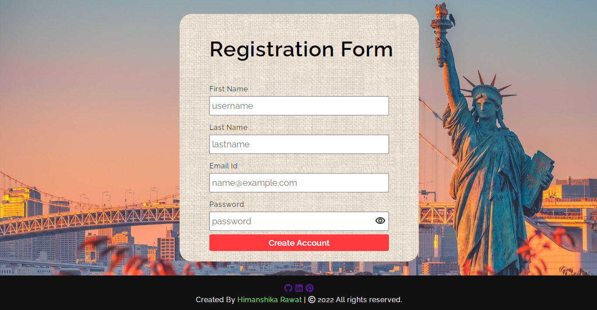

# Registration Form

A user form with robust validation using Vanilla JavaScript. Implemented validation for fields like username and password, to authenticate user.

# Appearance

## Tech Stack

- HTML/CSS
- Javascript

## Author

-   Himanshika Rawat - follow me on 👇
-   [GitHub](https://www.github.com/himanshirawat)
-   [LinkedIn](https://www.linkedin.com/in/himanshi-rawat/)
-   [Pinterest](https://in.pinterest.com/himanshikarawat/)

## Live Link

https://regform.netlify.app/